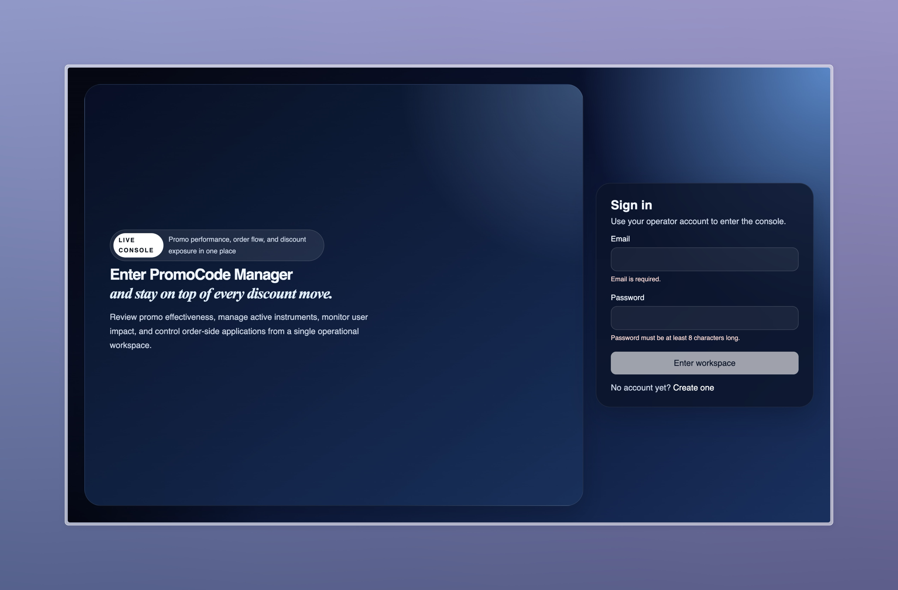
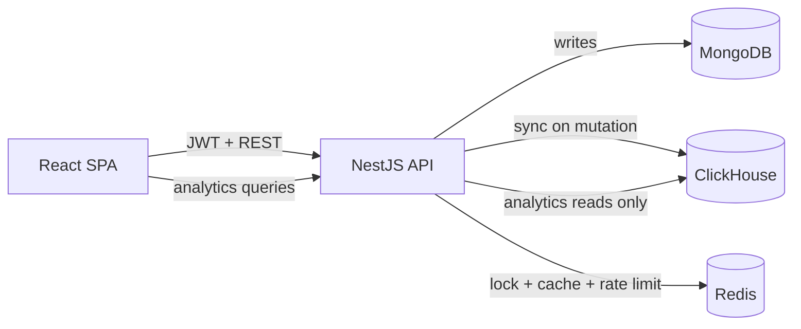
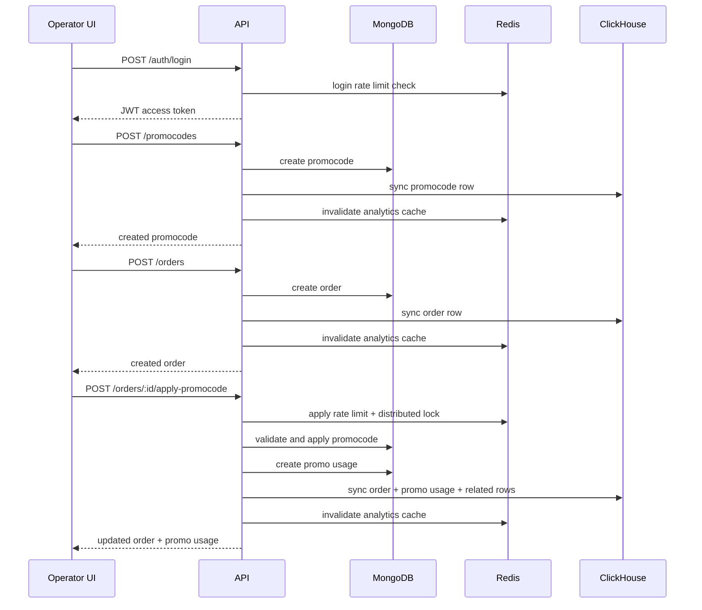

# PromoCode Manager



PromoCode Manager is a fullstack internal console for operating promo instruments, orders, and analytics with a strict command/query split.

- MongoDB is the write source of truth
- ClickHouse is the analytics read model
- Redis is used for distributed locking, analytics caching, and Stage 11 rate limiting
- NestJS powers the API
- React + Vite powers the neobank-style operator console


## Repository Structure

```text
apps/
  api/         NestJS backend
  web/         React Vite SPA
packages/
  shared/      Shared TypeScript package
docs/          Planning, contracts, schema, and design notes
```

## Architecture



## Core Runtime Flow



## Main Pages

- `/login`
- `/register`
- `/app/analytics/users`
- `/app/analytics/promocodes`
- `/app/analytics/promo-usages`
- `/app/operations/promocodes`
- `/app/operations/orders`

Current operations coverage:

- create, edit, and deactivate promocodes
- create and delete current-user orders
- apply a promocode to an existing order

## Startup

1. Install dependencies:
   - `pnpm install`
2. Build the workspace:
   - `pnpm build`
3. Start the full stack:
   - `docker compose up --build`

Environment notes:

- Docker Compose already uses the checked-in example env values.
- Copy root `.env.example` to `.env` only when you want to override host ports like
  `API_PORT`, `WEB_PORT`, `MONGO_PORT`, `CLICKHOUSE_HTTP_PORT`, or `REDIS_PORT`.
- For local non-Docker development, prefer `apps/api/.env.local` and `apps/web/.env.local`
  instead of modifying the example files.

## Useful Commands

- `pnpm dev`
- `pnpm typecheck`
- `pnpm build`
- `pnpm test`
- `pnpm seed`
- `pnpm compose:up`
- `pnpm compose:down`

## Local URLs

- Docker Compose defaults:
  - Web: `http://localhost:5173`
  - API: `http://localhost:3000/api/v1`
  - Swagger: `http://localhost:3000/api/v1/docs`
  - If a local port is already occupied, override it through root env vars such as
    `API_PORT`, `WEB_PORT`, `MONGO_PORT`, `CLICKHOUSE_HTTP_PORT`, or `REDIS_PORT`
    before running `docker compose up --build`.
- Local manual dev path commonly used during audit:

  - API: `http://localhost:3300/api/v1`
  - Swagger: `http://localhost:3300/api/v1/docs`
  - Health: `http://localhost:3300/api/v1/health`